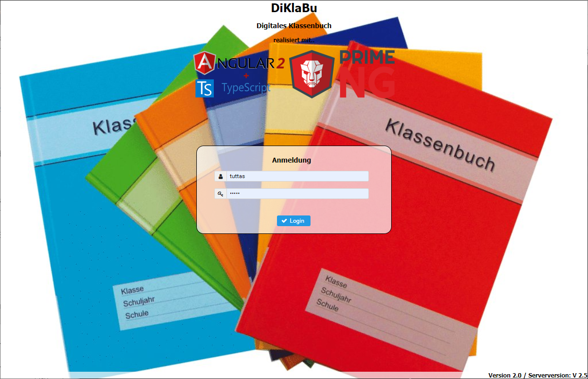
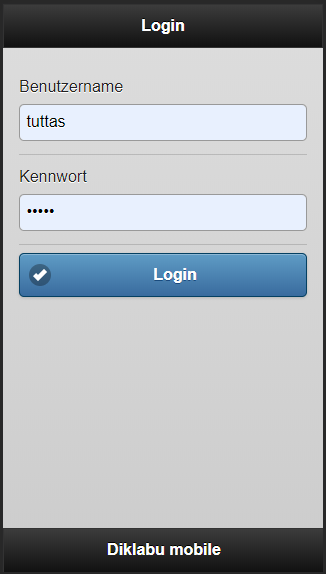

# Installation vom diklabu für die BBS3
## Der Docker Containers
### Vorbereitungen
Zunächst muss eine leere Datenbank geladen werden, z.B. über
```
wget https://github.com/jtuttas/diklabu/raw/master/Diklabu/doc/diklabu.GDB
```
Anschließend muss die Config in einem Verzeichnis auf dem Docker Server abgelegt werden.

### Starten des Containers
Anschließend ist der Docker Container zu starten über:
```
docker run -d -i -t -v {Pfad zur Ordner mit diklabu.GDB}:/var/lib/firebird/2.5/data -v {Pfad zum Verzeichnis mit config.json}:/etc/diklabu -v {Pfad zum Schülerbilder Verzeichnis}:/home/diklabu/images -p 8080:8080 tuttas/diklabu
```
## Synchronisation über Powershell
### Voraussetzungen
Das Ausführen von Powershell Skripten muss erlaubt werden (als Administrator)
```
Set-Executionpolicy RemoteSigned
```
Das diklabu Powershell Modul muss installiert sein, entweder über die Powershell Galery als Admin über:
```
Install-Module -Name diklabu
```
oder aber durch ausführen des Scriptes **loadModule.ps1** aus dem Repository.

### Verbindung zum Diklabu
Die Verbindung zum Diklabu wird über den Befehl:
```
Login-Diklabu -uri http://192.168.9.51:8080/Diklabu/api/v1/ -credential (get-credential "KirkJa")
```

### Verbindung zu BBS Planung
Die Verbindung zu BBS Planung wird aufgebaut über:
```
Connect-BbsPlan {Pfad zu BBS PLanung}
```
Sollte es hier zu einem Fehler kommen muss zunächst die *Microsoft Access database engine 2010* in der Version für das Betriebssystem installiert werden.

### Synchronisation mit BBS Planung
Wie oben beschrieben, muss eine Verbindung zu BBSPlanung und eine Verbindung zum diklabu möglich sein. Anschließend ist das Script **Sync-BBSPlan.ps1** zu starten.
## Aufrufen der Webseiten
Die Desktop Webseite wird aufgerufen über:
```
http://{Server IP}:8080/Diklabu/abbs3/
```

Der mobile Client wird aufgerufen über:
```
http://{Server IP}:8080/Diklabu/diklabu/mobile.html
```

## Backup
Zur Sicherung der Installation muss die Datenbank **diklabu.GDB** und das Schüler-Bilderverzeichnis regelmäßig gesichert werden!


