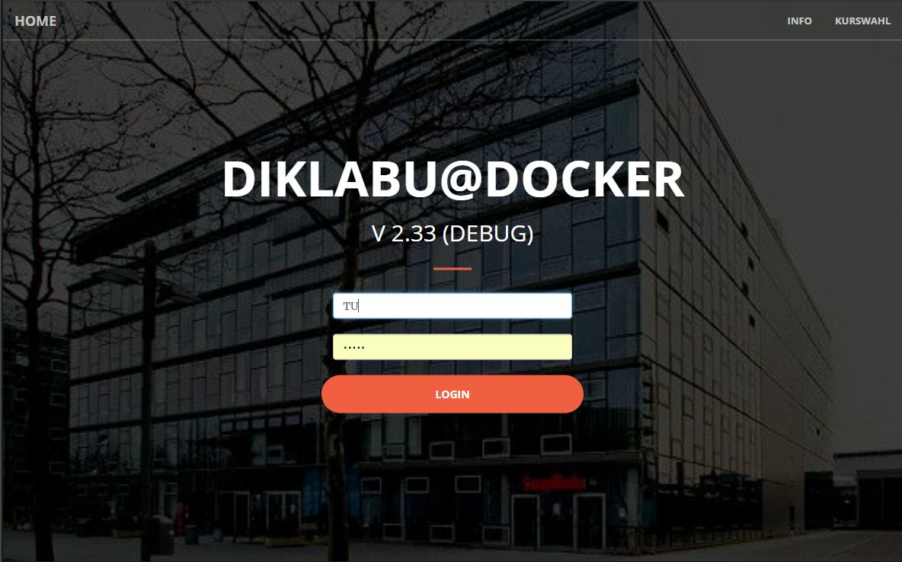
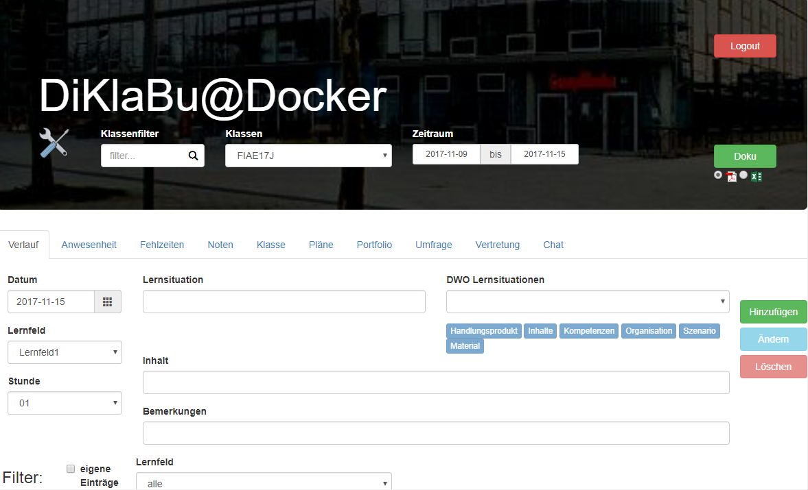
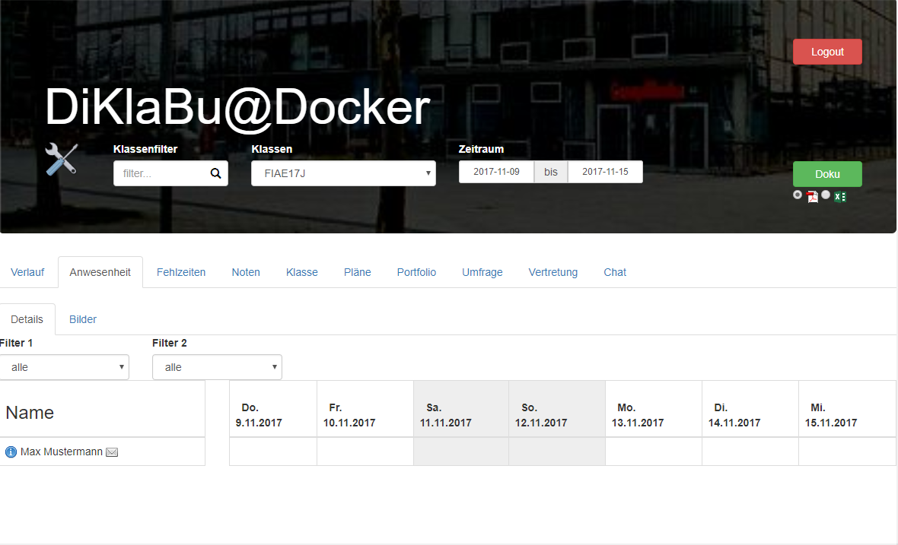
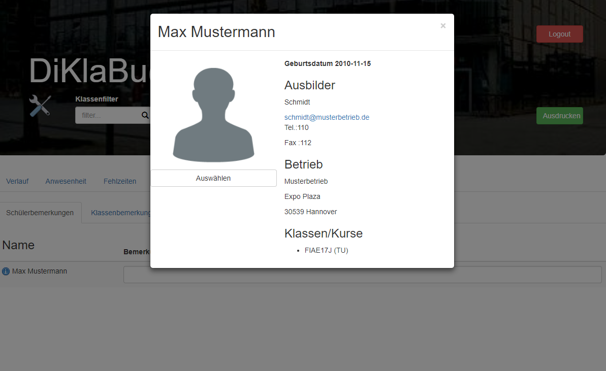

# Digitales Klassenbuch (diklabu)
RESTful Webservice inkl. Client für das digitale Klassenbuch.
## Konfiguration
Das diklabu wird konfiguriert über eine Datei mit dem Namen *config.json*, die folgende Einträge aufweist.

```js
{
    "debug": false,
    "auth": true,
    "IMAGE_FILE_PATH": "/home/diklabu/images",
    "ATEST_FILE_PATH": "/home/diklabu/atest",
    "TEMPLATE_FILE_PATH": "/home/diklabu/templates",
    "LOGO_PRINT":"http://localhost:8080/Diklabu/assets/Logo_bitmap.gif",
    "HEADLINE_PRINT":"BBS3 Hannover",
    "adminusers": ["TU","TUTTAS","KEMMRIES2","KirkJa"],
    "verwaltung": ["BU"],
    "AUTH_TOKE_TIMEOUT" : 432000000,
    "ldaphost": "ldap://10.0.75.10:389",
    "binduser": "CN=admin,CN=Users,DC=tuttas,DC=de",
    "bindpassword":"admin",
    "context": "OU=mmbbs,DC=tuttas,DC=de",
    "smtphost": "smtp.uni-hannover.de",
    "port": "587",
    "user": "joerg.tuttas@ifbe.uni-hannover.de",
    "pass": "geheim",
    "clientConfig" : {
          "DWO": "http://service.joerg-tuttas.de:8082/dwoRest/webresources/",
        "SERVER": "http://localhost:8080",
        "WEBSOCKET": "ws://",
        "TWOFA": false,
        "DIKLABUNAME":"DiKlaBu@Docker"
    }
}
```
Zu den einzelnen Einträgen:
- *debug*: Schalter um den debug Modus ein oder aus zu schalten.
- *auth*: Schalter für die Authentifizierung. Ist dieser auf true gesetzt erfolgt die Authentifizierung über LDAP.


## Installations
Zunächst muss eine leere Datenbank herunter geladen werden (https://github.com/jtuttas/diklabu/raw/master/Diklabu/doc/diklabu.GDB) und z.B. gespeichert werden nach **c:\Temp**

Die Konfigurationsdatei *config.json* [download](https://raw.githubusercontent.com/jtuttas/diklabu/master/Diklabu/config.json) muss auch in einem Volume gemountet werden (Hier auch in c:/Temp gespeichert).

Es existiert eine Docker Installation des diklabu's.
```
docker pull tuttas/diklabu
docker run -v c:/Temp:/var/lib/firebird/2.5/data -v c:/Temp:/etc/diklabu -i -t -p 8080:8080 tuttas/diklabu
```
Dann aufruf der Seite http://localhost:8080/Diklabu/dev2/ bzw. http://localhost:8080/Diklabu/abbs3/

## Screenshots
### Anmeldung

### Unterrichtsverlauf

### Anwesenheit

### Details

