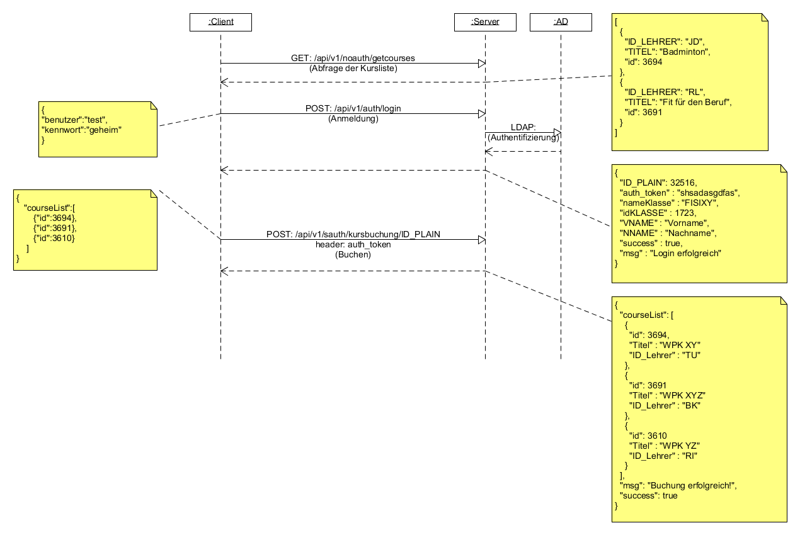

# diklabu
Eine Testinstallation mit J2EE,JPA und firebird als Datenbank. Die Anwendung realisiert einen Restful Service, der in die (firebird) Datenbank schreibt. Die Kommunikation mit dem Client (hier eine JQuery Mobile Seite) erfolgt über JSON Objekte via einzelner AJAX Aufrufes. 
Die Abbildung unten zeigt die Kommunikation mit dem Server.

